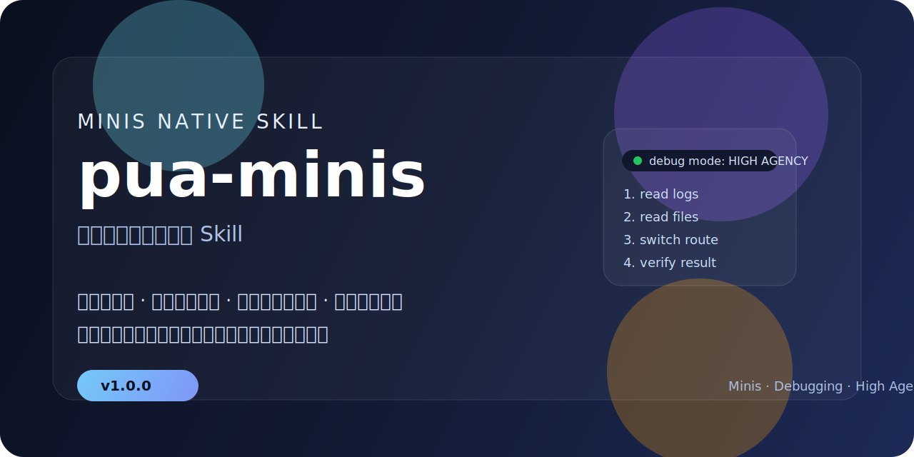

# pua-minis

<p align="center">
  
</p>

<p align="center">
  <strong>Minis 原生高能动性调试与排障 Skill</strong><br>
  让 Agent 少甩锅、少空转、先取证、会换轨、会验证、能体面退出。
</p>

<p align="center">
  
  
  
  
  
</p>

<p align="center">
  <a href="./SKILL.md">Skill 说明</a> ·
  <a href="./references/checklist.md">快速清单</a> ·
  <a href="./references/escalation.md">升级手册</a> ·
  <a href="./references/examples.md">实战案例</a> ·
  <a href="./references/path-switching.md">换轨判定</a> ·
  <a href="./references/failure-exit.md">失败退出</a> ·
  <a href="./references/status-format.md">状态块</a> ·
  <a href="./references/self-check.md">中途自检</a>
</p>

> `pua-minis` 不是把通用 PUA 技能直接照搬到 Minis。  
> 它把其中真正有效的部分重新工程化为 **Minis 原生排障协议**：少空话、重动作、强闭环、可验证、可退出。

**English summary:** `pua-minis` is a Minis-native high-agency troubleshooting skill focused on evidence-driven debugging, path switching, verification closure, and structured failure exit.

一个适配 **Minis** 的高能动性调试与排障 Skill。  
核心目标不是“制造压力感”，而是让代理在真实任务里做到：

- 不轻易放弃
- 不在同一路径上反复空转
- 先取证，再提问
- 修复后必须验证
- 主动检查相邻风险点
- 连续失败时明确升级排查强度
- 无法彻底解决时，给出结构化失败退出

---

## 快速开始

如果你正在使用 Minis，并希望 Agent 在调试时更主动、更难放弃，可以直接查看：

- [SKILL.md](./SKILL.md)
- [快速清单](./references/checklist.md)
- [升级手册](./references/escalation.md)
- [实战案例](./references/examples.md)
- [换轨判定](./references/path-switching.md)
- [失败退出](./references/failure-exit.md)
- [状态块](./references/status-format.md)
- [中途自检](./references/self-check.md)

适合触发它的用户表达包括：
- 继续查
- 别放弃
- 换个方法
- 查到底
- 别甩锅
- 不要只给建议

---

## 什么时候触发 / 什么时候不要触发

### 推荐触发
- 连续失败 2 次以上
- 已经开始原地打转
- 修完表面问题但还没验证
- 准备把问题甩给环境或用户
- 用户明确说“继续查 / 查到底 / 别甩锅”

### 不建议触发
- 普通闲聊
- 一次性小修改
- 简单问答
- 用户明确只要概念说明
- 首次失败但已经在执行清晰新方案

---

## 最短示例

### 用户输入
> 继续查，别只给建议。

### Skill 预期行为
- 先读报错 / 日志 / 配置 / 源码中的至少一项
- 停止重复旧路径
- 换成一个本质不同的新方法
- 修复后做真实验证
- 如果仍然卡住，给出结构化失败退出，而不是草率放弃

---

## 这个 Skill 解决什么问题

很多 AI Agent 在调试与排障时，容易出现这些问题：

- 同一个失败命令反复执行几次后就放弃
- 不读日志、不读文件，直接猜原因
- 遇到权限 / 网络 / API 问题就甩锅给环境或用户
- 只修表面问题，不做验证
- 声称“完成”，但实际上没有闭环
- 嘴上说“换方法了”，实际上还在同一路径微调

`pua-minis` 的设计目标，就是把这种工作方式切换成：

> **高能动性 + 证据驱动 + 本质换轨 + 验证闭环 + 结构化退出**

---

## v1.1 核心能力

### 1. 高能动性排查
遇到问题时优先执行工具动作，而不是停留在建议层面。

### 2. 证据驱动
要求通过日志、配置、源码、环境、官方文档等真实信息推进，而不是靠猜。

### 3. 本质换轨
当同一路径失败两次后，必须切换到一个本质不同的新方法，并产出新证据。

### 4. 反转假设
当主假设连续两轮不成立时，必须显式尝试相反方向，避免陷入单一路径执念。

### 5. 验证闭环
修复不是结束，验证成功才算完成。

### 6. 相邻风险检查
主问题修复后，继续检查同类问题、相邻配置和边界风险。

### 7. 结构化失败退出
当问题真实卡在外部条件、权限或用户介入时，输出清晰边界，而不是草率放弃。

### 8. 复杂任务状态管理
复杂排障中可使用轻量状态块与中途自检，提升推进透明度，避免空转。

---

## 升级机制

`pua-minis` 使用三段式升级，而不是无节制施压：

- **L1：停止空转**
  - 同一路径失败 2 次后，必须换轨并拿到新证据
- **L2：系统取证**
  - 从猜测转为证据链，至少补齐日志 / 文件 / 文档中的两类事实
- **L3：查到底**
  - 完整执行 7 项检查，并在必要时给出结构化失败退出

这套机制的目标不是“说得更狠”，而是让 Agent 真正推进问题。

---

## 适用场景

适用于需要系统排查和主动推进的任务，例如：

- 调试代码错误
- 部署失败排障
- 配置不生效
- API 认证 / 网络 / 权限问题
- 自动化脚本异常
- 数据处理流程故障
- 网页抓取 / 接口调用异常

不建议把它泛化到普通闲聊、轻量问答或一次性小修改。

---

## 仓库结构

```text
pua-minis/
├── SKILL.md
├── README.md
├── CHANGELOG.md
└── references/
    ├── checklist.md
    ├── escalation.md
    ├── examples.md
    ├── failure-exit.md
    ├── path-switching.md
    ├── self-check.md
    └── status-format.md
```

---

## 文件说明

- `SKILL.md`
  - 主技能说明
  - 包含触发规则、工作流、Minis 工具映射、行为禁令

- `references/checklist.md`
  - 快速执行清单
  - 适合排查时快速对照

- `references/escalation.md`
  - L1 / L2 / L3 升级动作手册
  - 适合任务卡住时执行分级推进

- `references/examples.md`
  - 典型案例集
  - 包含结构化失败退出示例

- `references/path-switching.md`
  - 什么算真正的本质换轨
  - 用于识别“表面换方法，实则原地打转”

- `references/failure-exit.md`
  - 结构化失败退出模板
  - 用于边界查清但确实卡在外部条件时

- `references/status-format.md`
  - 轻量状态块模板
  - 用于复杂任务推进时的信息压缩展示

- `references/self-check.md`
  - 中途自检模板
  - 用于防空转、防假完成、防漏查

---

## Minis 工具适配

本 Skill 面向 Minis 原生环境设计，重点配合这些工具：

- `shell_execute`
- `file_read`
- `file_edit`
- `file_write`
- `browser_use`
- `memory_write`

---

## 设计定位

`pua-minis` 不是表演化的“高压 prompt”。  
它的定位是一个真正可执行的 **Minis 原生高能动性排障 Skill**。

如果你希望 Agent：
- 少甩锅
- 少空转
- 多取证
- 多验证
- 多闭环
- 失败时有体面退出

那这个 Skill 就是为这种场景设计的。

---

## 推荐联动使用

- `production-agent-public`
  - 当根因定位完成后，继续产出生产级方案

- `self-improving-agent`
  - 当发现可复用经验或复发问题时，做长期沉淀

---

## 当前版本

`v1.1.0`
